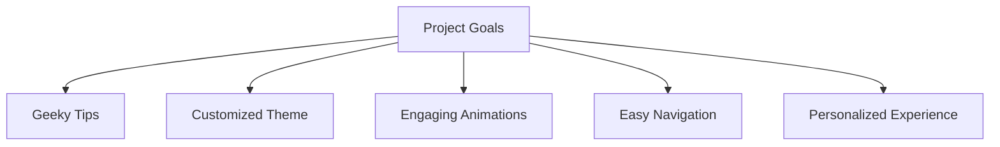

#  

Delight in a collection of daily tips, facts, and recommendations tailored to your nerdy interests. From tech tricks and programming hacks to sci-fi trivia and gaming strategies, Sturdy Octo Goggles has it all.

## Features

- **Nerdy Tips:** Explore a curated collection of daily tips and facts spanning various nerdy interests.
  
- **Wide Range of Topics:** Whether you're into technology, science fiction, gaming, movies, or comics, Sturdy Octo Goggles has something for every nerd.

- **Engaging Content:** Discover new tech tricks, programming hacks, sci-fi trivia, gaming strategies, and more to satisfy your inner nerd.

- **Customization Options:** Personalize your experience by saving your favorite tips or marking tips as "read."

## Project Goals:

## Screenshots
(once i finish)

**Why Sturdy Octo Goggles?**

Whether you're a seasoned geek or just dipping your toes into the vast world of nerdom, NerdTips is your go-to companion for expanding your nerdy knowledge and embracing your inner nerd. Download NerdTips today and embark on a journey of discovery, one nerdy tip at a time!

## Installation

1. Clone the repository.
2. Open the project in Android Studio.
3. Build and run the app on an emulator or a physical Android device.

## How to Use

1. Launch the app.
2. Browse through the collection of nerdy tips and facts.
3. Tap on a tip to view more details or mark it as "read."
4. Save your favorite tips for future reference.

## Feedback

I welcome any feedback or suggestions to improve the app. Feel free to [submit an issue](link-to-issue-tracker) on my GitHub repository.

## License

This project is licensed under the [MIT License](link-to-license-file).

